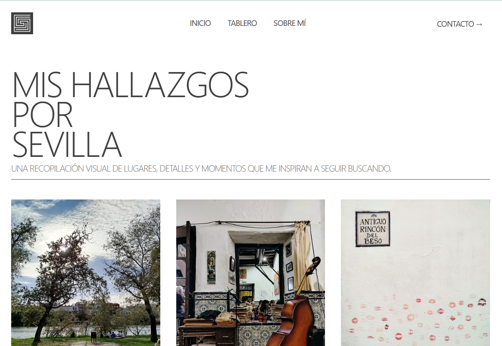
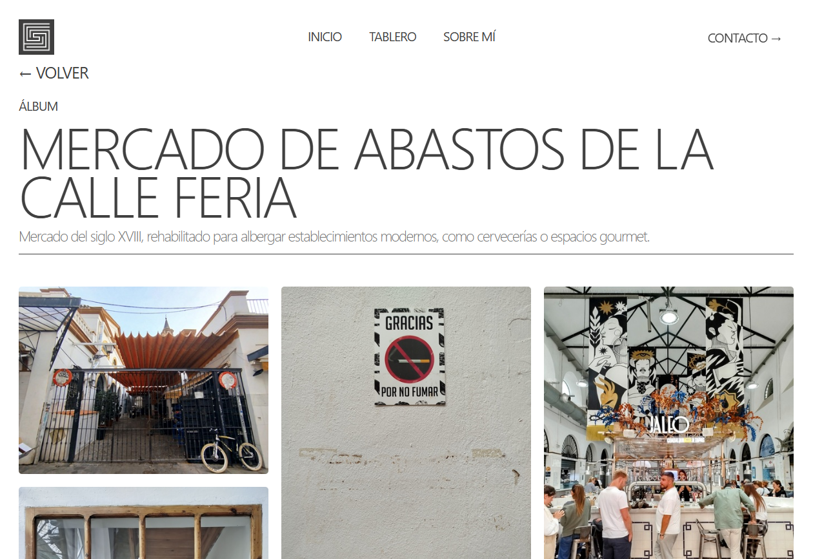

# Un Gallego por Sevilla

**"Encontrándome gente, cosas que hacer y lugares interesantes, mientras escapo de la pantalla y de las líneas de código."**

Este proyecto es un **diario visual interactivo** que narra mi experiencia viviendo en el sur de España. Más allá de un blog personal, es una demostración técnica de desarrollo Front-End moderno, uniendo diseño estético, animaciones fluidas y rendimiento optimizado.

1. [Sobre el Proyecto](#sobre-el-proyecto)
2. [Stack Tecnológico](#stack-tecnológico)
3. [Galería y Demo](#galería-y-demo)
4. [Retos y Aprendizajes](#retos-y-aprendizajes)
5. [Agradecimientos](#agradecimientos)
6. [Autor](#autor)

---

# Sobre el Proyecto

**Un Gallego por Sevilla** nace de la necesidad de unir mis dos pasiones actuales: el desarrollo web y la fotografía callejera. La aplicación permite a los usuarios explorar "hallazgos" por la ciudad a través de un tablero interactivo y visualizar álbumes de fotos dinámicos.

El objetivo principal no era solo mostrar contenido, sino crear una **Experiencia de Usuario (UX)** pulida, donde las transiciones, la carga de medios y la adaptabilidad a móviles fueran prioritarias.

---

# Stack Tecnológico

El núcleo de la aplicación es React, apoyado por un ecosistema moderno de herramientas:

- Frontend: React (Vite), Tailwind CSS para el estilado.

- Animaciones: Framer Motion (Orquestación de entradas, transiciones de página y micro-interacciones).

- Backend / BaaS: Firebase (Firestore para base de datos y Storage para activos estáticos).

- Streaming: Mux (Optimización y entrega de video adaptativo).

- Routing: React Router DOM + HashLink para navegación suave.

---

# Galería y Demo

- Página web: https://galician-man-in-seville.vercel.app/

## Hero:

## Tablero

## Álbum

---

# Retos y Aprendizajes

Durante el desarrollo de este proyecto, me enfrenté a desafíos técnicos que me permitieron profundizar en arquitecturas modernas:

1. 🖼️ Gestión y Optimización de Imágenes

Uno de los mayores cuellos de botella en webs visuales es la carga de imágenes.

Reto: Evitar el layout shift y los tiempos de carga largos al traer fotos de alta calidad desde Firebase.

Solución: Implementación de carga diferida (lazy loading), esqueletos de carga (skeletons) y optimización de formatos.

2. 🎥 Streaming de Video Eficiente (Mux)

Inicialmente, cargar videos pesados directamente en el Hero comprometía el rendimiento.

Aprendizaje: Migré de archivos estáticos pesados a Mux, un servicio de streaming API-first.

Resultado: Carga instantánea, bitrate adaptativo según la conexión del usuario y una mejora drástica en las métricas de Core Web Vitals.

3. 📱 Diseño Responsivo Avanzado

No me conformé con que "cupiera" en la pantalla.

Estrategia: Diseñé múltiples breakpoints personalizados en Tailwind. La disposición de los elementos cambia drásticamente entre móvil, tablet y escritorio (especialmente en el Dashboard y el Footer) para garantizar que la experiencia sea nativa en cada dispositivo.

4. ✨ Animaciones con Propósito (Framer Motion)

Quería que la web se sintiera "viva" pero sin marear.

Implementación: Uso de AnimatePresence y variantes escalonadas (staggerChildren). Aprendí a orquestar animaciones de entrada complejas y transiciones suaves entre rutas, mejorando la percepción de fluidez de la SPA.

5. 💡 Del Hobby al Producto Real

Quizás el aprendizaje más valioso fue transformar algo que me gusta (viajar y fotografiar) en un producto digital real. Esto me enseñó a gestionar el alcance del proyecto (MVP), priorizar funcionalidades y pulir los detalles finales que diferencian un ejercicio de clase de una web profesional.

---

# Agradecimientos

Este proyecto no habría sido posible sin el apoyo de mis compañeros del Certificado de Profesionalidad en Desarrollo de Aplicaciones con Herramientas Web.

Un agradecimiento especial a Pablo Almellones, por sus constantes consejos, revisiones de código y tips para llevar la UI/UX al siguiente nivel.

A Inmaculada Contreras, por su apoyo incondicional y por ayudarme a asentar las bases de mis conocimientos en desarrollo.

Y a todos los compañeros que testearon la web y me dieron feedback constructivo.
